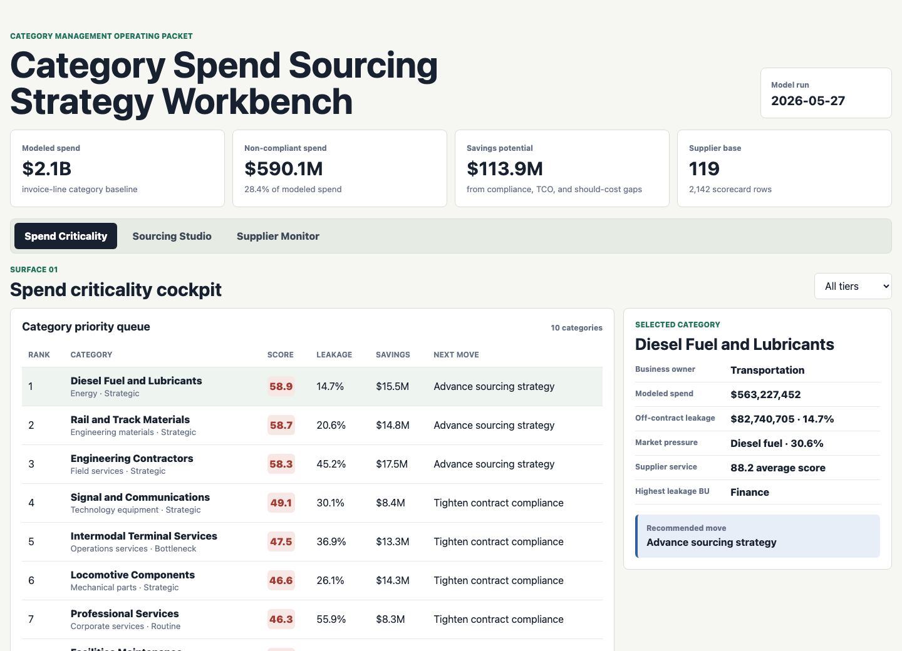
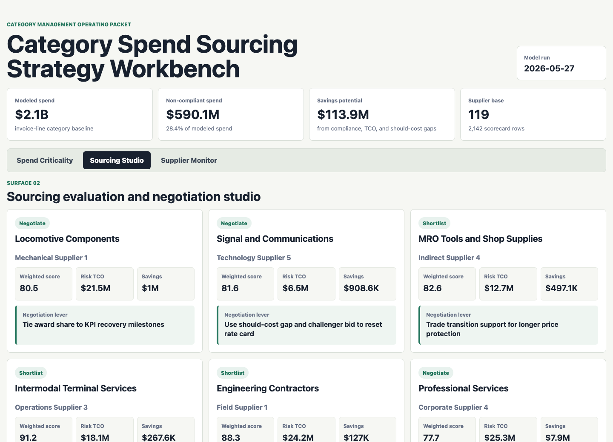
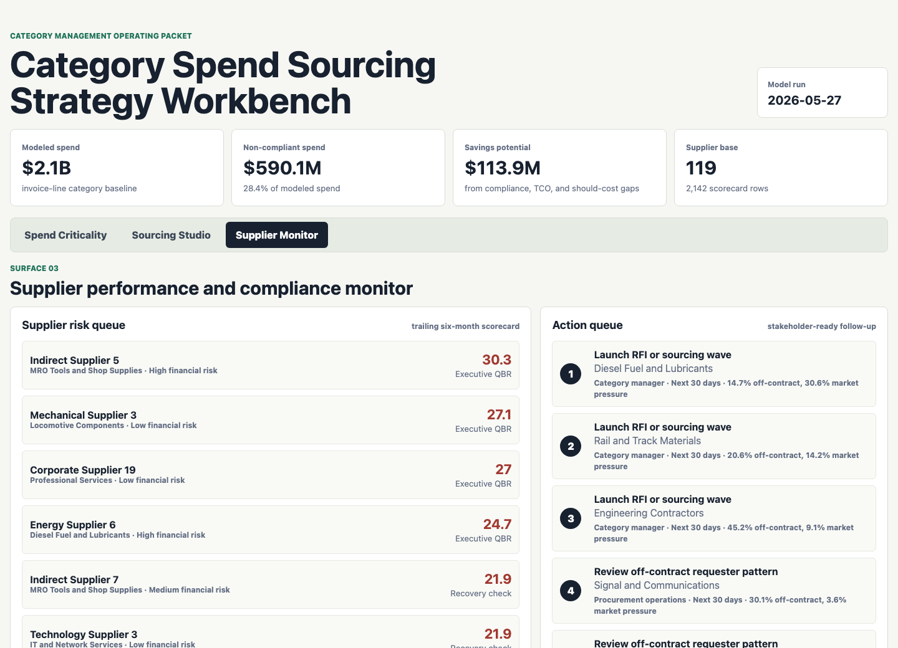

# Category Spend Sourcing Strategy Workbench

An interactive category sourcing portfolio artifact for a freight rail procurement team. The workbench turns synthetic spend, supplier, market, contract, and sourcing-event data into a repeatable operating packet for category strategy, TCO review, negotiation prep, supplier performance management, and off-contract spend follow-up.



The spend criticality cockpit ranks categories by operational criticality, contract leakage, supplier concentration, market pressure, supplier service risk, price variance, and savings potential. It is designed to help a Category Manager decide which category needs a sourcing wave, compliance review, supplier recovery discussion, or monthly monitoring.



The sourcing studio converts RFP-style bid responses into weighted supplier evaluations, risk-adjusted TCO scenarios, negotiation targets, transition-cost visibility, and recommended negotiation levers.



The supplier monitor shows trailing supplier KPI risk, service-level follow-up, business-owner action queues, and evidence that can be used in supplier QBRs or procurement operations reviews.

## What This Demonstrates

- Spend analysis at category, supplier, business unit, region, contract-status, and invoice-line grain.
- Category baseline refresh logic, off-contract leakage detection, and savings opportunity prioritization.
- Market-index-style cost-driver monitoring for materials, fuel, labor, services, and technology categories.
- Weighted sourcing evaluation, risk-adjusted total cost of ownership, and negotiation model outputs.
- Supplier scorecards for on-time performance, defects, safety, invoice accuracy, responsiveness, and SLA status.
- Stakeholder-ready action queues that connect analysis to procurement follow-up.

## Data

All data is deterministic synthetic data generated for this public portfolio artifact. It does not represent any real railroad procurement records, suppliers, invoices, contracts, bids, market prices, service levels, or operating performance.

The synthetic data is modeled on common category-management and procurement structures:

- Category baselines with contract coverage, criticality, strategic tier, market index, supplier count, should-cost gap, and business owner.
- Supplier master data with qualification, capacity, safety, diversity, financial risk, service region, and approval status.
- Invoice-line spend with supplier, category, business unit, region, contract status, volume, unit price, payment terms, and price variance.
- Monthly market-index-style series for commodity, labor, energy, technology, and services cost drivers.
- Supplier scorecards with on-time in-full performance, defect rate, safety incidents, invoice accuracy, responsiveness, service score, and SLA status.
- RFP evaluation scenarios with commercial, technical, risk, and implementation scores, transition cost, risk-adjusted TCO, and negotiation target.

The generator uses a fixed random seed in `scripts/score_operating_data.py`, so the outputs are reproducible.

## Analysis Outputs

- `analysis/outputs/category_criticality_queue.csv`
- `analysis/outputs/sourcing_scenario_recommendations.csv`
- `analysis/outputs/supplier_scorecard_risk_queue.csv`
- `analysis/outputs/category_action_queue.csv`
- `analysis/outputs/app_payload.json`
- `analysis/executive_findings.md`
- `analysis/methodology.md`
- `analysis/sql_checks.sql`

## Role Fit

This artifact is built for a Category Analyst role that needs to gather spend data, refresh category baselines, monitor contract compliance, analyze market trends and cost drivers, build sourcing evaluation models, support negotiation preparation, maintain supplier databases, and develop supplier KPI scorecards.

## Run Locally

```bash
npm run analyze
npm start
```

Then open `http://localhost:4174`.

## Scope

This is a static public portfolio artifact with reproducible synthetic data and transparent scoring logic. It does not connect to live ERP, Ariba, Coupa, SAP, Power BI, Tableau, supplier portals, contract repositories, rail operating systems, commodity feeds, or private procurement data. It shows how a category analyst can structure spend criticality, sourcing evaluation, TCO reasoning, supplier scorecards, and stakeholder follow-up in one defensible workflow.
